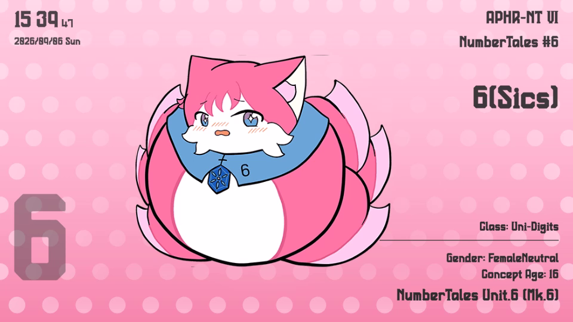
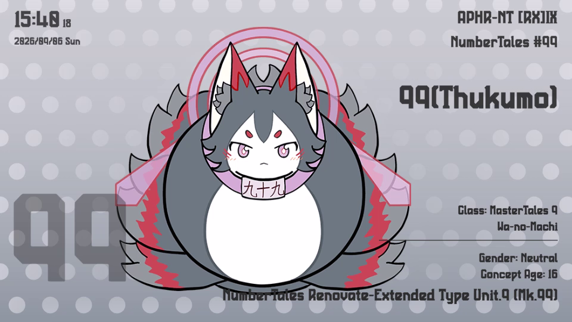
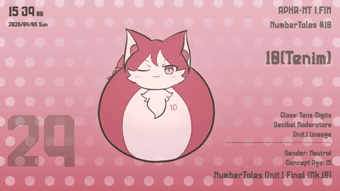
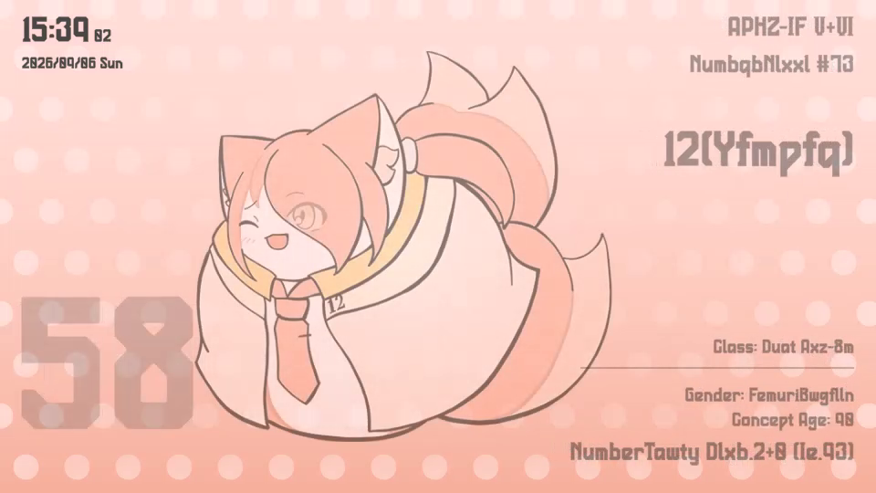

# NTsWallpaperEngine

一次創作「ナンバーテールズ」のキャラクター紹介カードを自動で巡回表示する**ディジタルサイネージ**（Unity 6 / URP 2D Renderer）。
表示端末は **Raspberry Pi 4B**。カードの中身は創作DB（サブモジュール）から**自動形成**するので、キャラクターを手で打ち込む場所はどこにもない。

## いまの画面

| | |
| --- | --- |
|  |  |

背景・文字色は個体のテーマ色（`ColorPalette`）から作るので、切り替わるたびに画面全体の色が変わります。

**切り替わるところ**（数字のカウント＋文字のスクランブル。等倍）:



> 画像は `docs/captures/`。撮り直しは `Signage/Play + Record`（Unity Recorder → `Recordings/*.mp4`・git 管轄外）を撮って、
> サンドボックスの ffmpeg で静止画と GIF に落とす。手順は [AGENTS.md](AGENTS.md) 11章。

## 画面の作り

960x540 基準（`CanvasScaler` の参照解像度＝RPi の実行解像度）。シーンには枠だけがあり、値はランタイムが流し込みます。

| 位置 | 出しているもの | DBのフィールド |
| --- | --- | --- |
| 左上 | 時計 `HH:MM`＋小さい秒／下段に日付（英語曜日）。「:」は0.5秒周期で点滅 | — |
| 右上 | 型番 → 正式名称（全文・最大2行） → 英名 | `ModelNumber` / `FormalName_EN` / `Name_EN` |
| 中央やや左 | corefolder 画像（背後にソフトグロー）。全個体を同じ倍率で縮小してキャラ間のサイズ比を保つ | `Images.corefolder_PNGPath`（複数あればランダム） |
| 右下 | Class（1要素1行）→ 区切り線 → Gender / Concept Age → 英語機体名 | `Class` / `GenderType` / `ConceptAge` / `ModelName_EN` |
| 左下 | 大型番号（透かし風・カウント演出の主役） | `Num`（数値・数式部分のみ。`111-mp`→`111`, `3x11`→`3x11`） |

背景は3層 + グロー: **ベース**（テーマ色のパステル）／**縦グラデーション**（テーマ色を濃くした層）／**エッジドット**（中央は薄く四辺で強い）。
テーマ色は `ColorPalette` の `#ColorRole_Primary` → `Sub` → 先頭の順で拾い、背景の知覚輝度が閾値以上なら文字を黒系、下回れば白系に自動で切り替えます。

## アニメーション（本サイネージの必須要件）



*切り替わっている途中。番号は `58` を通過してカウント中、名前・型番・プロフィールはスクランブル文字のまま左から確定していく。*

| 演出 | 中身 |
| --- | --- |
| 数字カウント | フェードアウト中は現在番号から**カウントアップ**しながら消え、フェードイン中は次の番号へ**カウントダウン**で着地する（`numAnimDuration` 300 / `acceleration` 2.65 / `animationTime` 1.4秒） |
| 文字スクランブル | 未確定位置をランダム文字で表示し、左から確定させる。**文字種は保存**（数字→数字／英字→英字・大小維持／ローマ数字グリフ Ⅰ〜Ⅻ→ローマ数字／記号・空白は固定）。`textAnimSpeed` 0.6 でフェード完了後も走り切る |
| プロフィール行 | 「ラベル: 」は固定表示のまま、DBの値だけをスクランブルさせる |
| 大型番号の着地 | 数式表記（`3x11`）は数字部分をカウント・残りをスクランブルし、確定時に原文表記へ落とす。`%` や `∞` など数字を持たない個体は全体スクランブルのみ |

型番中の `IV` のようなローマ数字は、フォント収録のローマ数字グリフ（Ⅰ〜Ⅻ、13以上は `Ⅹ…`＋合成済み）へ差し替えてから表示します。

## 切り替え

| | |
| --- | --- |
| 自動 | 既定 **30秒**ごと。**秒針同期**（実時刻を間隔で割ったスロット境界で発火するので、30なら毎分00/30秒ちょうど） |
| 手動 | 画面を左クリック／タップ |
| 再生モード | **Random**（直前と同じ個体は連続しない）⇄ **Sequential**（`Num` 昇順）を `M` キーか右クリックで切替。算術表記（`3x11`→33）は計算値、16進表記（`0xA`）はデコード値で通常番号の後ろに別グループとして並ぶ |
| 日次リロード | 毎日 `dailyReloadHour`（既定 04時）にDBを読み直す。常時稼働のまま新キャラ・修正が反映され、失敗した日は直前のデータで継続する |

## データの流れ（サブモジュール駆動）

```
100BeautiesLab_CreationsDB/          creationsdb（RPi でOS側が日次 pull）
  data/Works_NumberTales/                          │
        │  Signage/Sync CreationsDB（ビルド時は自動）│
        ▼                                          ▼
  Assets/StreamingAssets/CreationsDB/  ←──── 環境変数 NTSWE_CREATIONSDB が優先
        │
        ▼
  CreationsDbLoader → SignageController → SignageCardView（カードUI）
```

- 読み込み先の優先順は **`NTSWE_CREATIONSDB` → `StreamingAssets/CreationsDB` → サブモジュール直読み**（エディタでの未同期時フォールバック）。
- `StreamingAssets/CreationsDB/` は**git管理外の生成物**。手で編集しない。
- 表示対象は `Progress` が `released` / `released(beta)` / `stillTentative` / `unreleased` の**いずれかで、かつ corefolder 画像を持つ**レコードだけ。
- `SameModels_DBLink` を辿って null のフィールドを継承（`Num` / `Num_Badge` / `Progress` / `Images` は継承しない。循環リンクは防御済み）。
- Class は `dict_Class` / `dict_Triples` と作品共通辞書（レゾンデイトルカンパニー / シンフォニー.XVI）で英文表記へ変換してから出します。

### 収録状況

<!-- roster:start -->

**表示対象 105 体 / 画像 181 枚**（2026-09-06 時点。`Signage/Update README Roster` が自動更新）

| DB | 表示対象 | corefolder 画像 |
| --- | --- | --- |
| `db_Primary.json` | 90 | 162 |
| `db_SemiPrimary.json` | 9 | 13 |
| `db_SelfSecondary.json` | 6 | 6 |

<!-- roster:end -->

個体名は未公開分を含むため README には出しません（件数のみ）。中身は創作DBサイト → https://database.numbertales-radiann.net/

## 動作環境

| | |
| --- | --- |
| エンジン | Unity **6000.6.0f1** / URP 17.6.0（2D Renderer） |
| 表示解像度 | **960x540** フルスクリーン（UIの基準解像度と一致。フルHDに拡大表示され、描画負荷は約1/4） |
| ビルド | **StandaloneLinux64 / Mono**（box64 互換性優先で IL2CPP は使わない）。`Signage/Build Linux x64 (RPi Signage)` → `Builds/LinuxSignage/` |
| 実機 | Raspberry Pi 4B + Raspberry Pi OS 64bit（Bookworm 以降・**デスクトップ版**）+ box64（RPI4ARM64 プリセット）。`MESA_GL_VERSION_OVERRIDE=3.3` で起動 |
| 想定fps | 15〜30fps（2D UI のみ。非公式構成のため実機検証必須） |

OSイメージへの組み込み・自動起動・DB日次pullのタイマー設定は [docs/raspberrypi-handoff.md](docs/raspberrypi-handoff.md) が正本（OS側は別Coworkプロジェクトの管轄）。

## リポジトリの中身

| パス | 中身 |
| --- | --- |
| `Assets/Scripts/Signage/` | ランタイム。`CreationsDbLoader`（DB読込・enrich・テーマ色）/ `SignageController`（切替・アニメ駆動・背景生成）/ `SignageCardView`（カードUIとスクランブル） |
| `Assets/Scripts/Signage/Editor/` | `SignageSceneBuilder`（シーン自動構築）/ `SignageDbSync`・`SignageDbUpdate`（DB同期・更新）/ `SignageFontAssets`（フォント同期・TMP生成）/ `SignageBuild`（Linuxビルド）/ `SignageCapture`（README用の録画と収録表） |
| `Assets/Scenes/SignageScene.unity` | 唯一のシーン。`Signage/Build Signage Scene` で作り直せる（手で組まない） |
| `Assets/Fonts/` | PenchantManufacture（英数・型番）/ Source Han Sans（和文フォールバック）/ D-DIN |
| `100BeautiesLab_CreationsDB/` | 創作DBサブモジュール（sparse・**読み取り専用**） |
| `PenchantManufacture_ImageAssets/` | フォントの正本サブモジュール（sparse）。`Assets/` 側の `.otf` は同期コピー（git管理外・`.meta` のみ追跡） |
| `scripts/` | `setup-submodule.ps1/.sh`（クローン直後のsparse設定）/ `rpi/run-signage.sh`・`rpi/update-creationsdb.sh`（実機側） |
| `docs/` | `raspberrypi-handoff.md`（引き渡し資料）/ `captures/`（READMEのプレビュー） |

## エディタメニュー（`Signage/`）

| メニュー | すること |
| --- | --- |
| `Build Signage Scene` | シーンを自動構築して保存する |
| `Sync CreationsDB (submodule → StreamingAssets)` | サブモジュールから表示対象分のDB・画像を同期 |
| `Update CreationsDB (git pull + sync)` | サブモジュールを fetch/pull してから同期（PATH上のgitが必要） |
| `Sync Penchant Font` / `Update PenchantManufacture` | フォントの同期・更新 |
| `Generate TMP Font Assets` / `Clear Penchant Dynamic Atlas` | TMP FontAsset の生成・動的アトラスの掃除 |
| `Build Linux x64 (RPi Signage)` | DB同期＋Linux x64 ビルド（`Builds/LinuxSignage/`） |
| `Play + Record` | Unity Recorder で Game View を 960x540 MP4 に録りながら Play（`Recordings/`・git管理外） |
| `Update README Roster` | この README の収録状況表を数え直して書き戻す |

## セットアップ

```bash
git clone --recursive https://github.com/radiann-kswg/NTsWallpaperEngine.git
cd NTsWallpaperEngine
pwsh scripts/setup-submodule.ps1     # Linux/macOS は scripts/setup-submodule.sh
```

sparse-checkout の設定は `.gitmodules` に保存されないため、**新規クローン時は必ずこのスクリプトを通す**こと。
その後 Unity で開き、`Signage/Sync CreationsDB` → `Signage/Sync Penchant Font` を実行してから `SignageScene` を Play。

## ライセンス

**CC BY-NC 4.0**（権利者: 百花繚乱研究所 / ラジアン）。フォント PenchantManufacture のみ **CC BY 4.0**。
サードパーティ・サブモジュールの扱いを含む詳細は [LICENSE.md](LICENSE.md)。

エージェント向けの運用ルール（ブランチ・Unity MCP・撮影とREADME更新・ロールプレイ）は [AGENTS.md](AGENTS.md) が単一情報源です。
